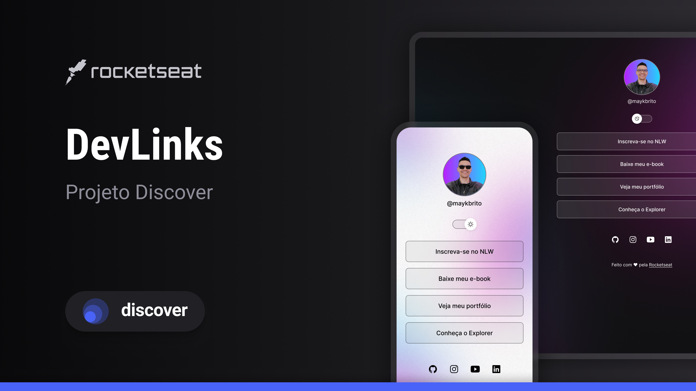

<h1 align="center"> Agrega Links</h1>

Interface de agregação de links para rede sociais ou para uso profissional.

  <a href="#-tecnologias">Tecnologias</a>&nbsp;&nbsp;&nbsp;|&nbsp;&nbsp;&nbsp;
  <a href="#-projeto">Projeto</a>&nbsp;&nbsp;&nbsp;|&nbsp;&nbsp;&nbsp;
  <a href="#-layout">Layout</a>&nbsp;&nbsp;&nbsp;|&nbsp;&nbsp;&nbsp;
  <a href="#memo-licença">Licença</a>

  

 

  

## 🚀 Tecnologias

Esse projeto foi desenvolvido com as seguintes tecnologias:

- HTML e CSS
- JavaScript
- Git e Github
- Figma

## 💻 Projeto

Programa de agregação de links para rede sociais ou para uso profissional como cartão de visitas online.

## 🔖 Layout

Você pode visualizar o layout do projeto através [DESSE LINK](https://www.figma.com/file/J1Z33MISC22YZB8wfxiIns/NLW-Copa-Explorer/duplicate). É necessário ter conta no [Figma](https://figma.com) para acessá-lo.

## :book: Conhecimentos

Foi possivel aprender diversos conceitos de programação frontend nesse bootcamp como:

HTML -> Estrutura basica do HTML e tags semânticas (ul e li);  

CSS -> Seletores específicos e universal, reset do navegador, diversos tipos de alinhamento (didplay-flax, display-box, position relative e position absolute), responsividade com Media Queries e animações com KeyFrames;  

JavaScript -> Interatividade da pagina com as funções: documentElement, html.classList, toggle, querySelectos, contains e setAttribute;  

Git e GitHub -> Versionamento local (git init, git add, git status, git commit, git config) e versionamento remoto (git push, git pull, criação de link).  

## :memo: Licença

Esse projeto está sob a licença MIT.

---

Feito com ♥ by Leandro Ferreira :wave: [Participe da comunidade!](https://discord.gg/rocketseat)
